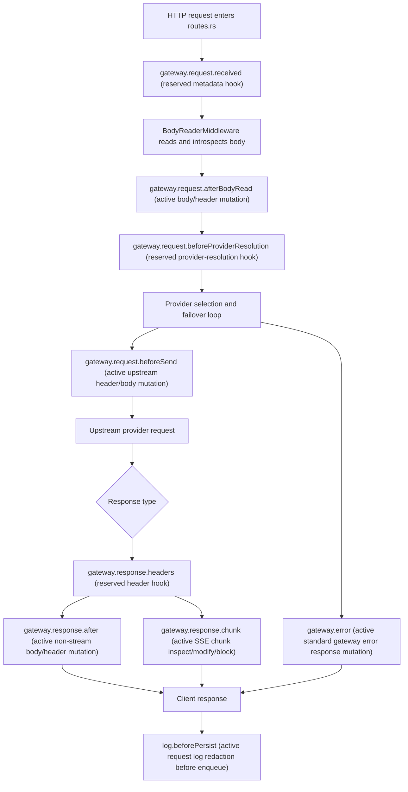

# aio coding hub Plugin System RFC

## 1. Purpose

The plugin system lets aio coding hub support community extensions for gateway request processing, gateway response inspection, log redaction, local configuration, and GUI management. The current public plugin direction is Extension Host-only: community plugins run through a host-managed Extension Host process, while the host owns rendering, lifecycle, permissions, diagnostics, and gateway mutation boundaries.

The priority scenarios are:

- Prompt optimization before a gateway request is sent upstream.
- Safety inspection of model responses, including streamed chunks.
- Redaction of sensitive URLs, keys, tokens, connection strings, logs, and GUI-visible data.

## 2. Non-Goals

- 短期不执行任意 JavaScript/TypeScript；当前只允许宿主管理的 Extension Host bundle 通过声明的 Host API 运行。
- Node.js and Deno are not default plugin runtimes.
- Third-party native dynamic libraries are not loaded into the Rust main process.
- 第三方代码不得直接进入主进程或 WebView.
- Plugins do not run inside the Tauri WebView.
- Plugins do not intercept local CLI input boxes or internal CLI UI events.
- The current Skill 市场 is not converted into this runtime.
- Enterprise RBAC, organization policy centers, and commercial settlement are separate future projects.

## 3. Existing Architecture Fit

The current host already has the right boundaries for a plugin system:

- GUI: Tauri 2, React, Vite, TypeScript.
- Backend host: Rust main process with an Axum gateway.
- Request entry: `src-tauri/src/gateway/routes.rs`.
- Proxy handler: `src-tauri/src/gateway/proxy/handler/mod.rs`.
- Body read middleware: `src-tauri/src/gateway/proxy/handler/middleware/body_reader.rs`.
- Provider resolution middleware: `src-tauri/src/gateway/proxy/handler/middleware/provider_resolution.rs`.
- Upstream send path: `src-tauri/src/gateway/proxy/handler/failover_loop/attempt/send.rs`.
- Response routing: `src-tauri/src/gateway/proxy/handler/failover_loop/response/response_router.rs`.
- Non-stream response handling: `src-tauri/src/gateway/proxy/handler/failover_loop/response/success_non_stream.rs`.
- Stream handling: `src-tauri/src/gateway/proxy/handler/failover_loop/response/success_event_stream.rs` and `src-tauri/src/gateway/streams/usage_tee.rs`.
- IPC command registry: `src-tauri/src/commands/registry.rs`.
- Data root: `~/.aio-coding-hub`, resolved through `src-tauri/src/infra/app_paths.rs`.
- Persistence: SQLite plus `settings.json`.

The plan document listed some historical paths. Implementation must follow the current `failover_loop` layout above.

## 4. Hook Boundary Principles

Prompt optimization can only be reliably implemented at gateway request stages. It cannot reliably alter text that a CLI edits internally before the gateway receives HTTP traffic. Therefore, 提示词优化只能在网关请求阶段可靠实现.

Hook insertion points must be explicit and tested. No request-body hook may be inserted at an unrecorded or untested point. The final M2 implementation must update this RFC with the exact gateway hook chain diagram after integration tests freeze the route.

Initial hook names:

- `gateway.request.received`
- `gateway.request.afterBodyRead`
- `gateway.request.beforeProviderResolution`
- `gateway.request.beforeSend`
- `gateway.response.headers`
- `gateway.response.chunk`
- `gateway.response.after`
- `gateway.error`
- `log.beforePersist`

### Final Gateway Hook Chain

The M2 implementation freezes the tested hook chain below. Hooks marked as active are wired into the hot path; reserved hooks remain part of the v1 contract and must be wired with tests before they can mutate runtime data.

Active request and response hooks execute through a timeout-bounded pipeline with permission-trimmed contexts, fail-open defaults, audit events, and circuit-open skips. Stream chunks run after gzip/protocol/response-fixer processing and before usage accounting, so safety and redaction plugins affect both client-visible chunks and downstream stream accounting. `log.beforePersist` receives a serialized request-log payload and may redact persisted fields without changing gateway status classification.

## 5. Runtime Roadmap

### Public Community Runtime: Extension Host

The public community runtime is a host-managed Extension Host. Plugins declare contributions in `plugin.json`, bundle their entry as `dist/extension.js`, and register handlers through host APIs such as:

- `api.commands.registerCommand`
- `api.gateway.registerHook`
- provider extension value APIs
- future protocol bridge APIs

The host decides when handlers run, what permission-trimmed context they receive, which mutations are accepted, when warm instances are reused, and when instances are disposed.

### Unsupported Legacy Runtime Ideas

Earlier drafts considered alternate WASM and arbitrary process runtimes. They are not public community runtimes in the current contract. Old local packages using those shapes are treated as unsupported pre-release legacy packages and should migrate to Extension Host gateway hooks.

## 6. Security Principles

- Least privilege: public manifests use `capabilities`; Extension Host public manifest 不支持 top-level `permissions`.
- The host trims hook context by capability, hook contract, runtime policy, and context budget before invoking plugin code.
- Sensitive headers such as `Authorization` and `Cookie` are visible only when the hook contract, context budget, and host policy allow that field for the installed capability set.
- Request and response body visibility is decided by the hook contract, context budget, and host policy. Internal context labels such as `request.body.read` or `request.header.readSensitive` describe host-side exposure decisions, not public top-level manifest permissions.
- Plugin mutation proposals are host-mediated. The host validates each proposed header/body/status/log mutation against the hook contract and runtime policy, then accepts, trims, or rejects it.
- High-risk capabilities require second confirmation.
- Upgrades that add capabilities require renewed authorization.
- Audit logs record install, enable, disable, config changes, capability changes, hook errors, hook timeouts, blocks, and high-risk mutations.
- Audit logs must not store sensitive raw values.
- Consecutive failures can quarantine a plugin.
- Safety-class plugins may use fail-closed behavior. Decorative plugins default to fail-open.
- `log.beforePersist` falls back to host redaction if plugin redaction fails.

## 7. Cross-Platform Principles

- All plugin paths are below `~/.aio-coding-hub/plugins`.
- Paths are built with `PathBuf` joins, not hard-coded `/`.
- Plugin IDs are validated before they become path segments.
- Canonical path checks prevent zip slip and directory traversal.
- Windows file locks must fail safely during update and rollback.
- macOS quarantine or code signing behavior must not require executing unsigned native binaries.
- Linux AppImage/deb/rpm layouts must write plugin data only to user data directories, never installation directories.

## 8. Skill Market Boundary

The Skill 市场 and this plugin system are separate:

- Skills are agent instruction/tooling assets.
- Plugins are user-installed runtime extensions for aio coding hub gateway, logs, settings, and GUI management.
- Skill repository cache code can inspire plugin package cache logic, but plugin packages, manifests, permissions, hooks, and runtime isolation are independent contracts.
- A Skill cannot bypass plugin permissions by being installed as a plugin.

## 9. Failure Policy Matrix

| Hook | Default policy | Configurable | Failure behavior |
| --- | --- | --- | --- |
| `gateway.request.received` | fail-open | yes | Skip plugin, audit failure. |
| `gateway.request.afterBodyRead` | fail-open | yes | Continue with original request, audit failure. |
| `gateway.request.beforeProviderResolution` | fail-open | yes | Ignore routing suggestions, audit failure. |
| `gateway.request.beforeSend` | fail-open | security plugins may fail-closed | Continue for decorative plugins; block for fail-closed security plugins. |
| `gateway.response.headers` | fail-open | yes | Return original headers. |
| `gateway.response.chunk` | security fail-closed, non-security fail-open | yes | Terminate stream or emit safe error for security failures. |
| `gateway.response.after` | security fail-closed, non-security fail-open | yes | Return safe error for security failures. |
| `gateway.error` | fail-open | no | Never hide the host error. |
| `log.beforePersist` | fail-closed-to-host-redaction | no | Use host redaction before persistence. |

## 10. Observability

Every hook execution records:

- `trace_id`
- plugin ID and version
- hook name
- elapsed time
- outcome
- failure policy
- mutation summary
- warning or block summary

English logs should be concise and operational, for example:

- `plugin hook timed out`
- `plugin hook blocked request`
- `plugin entered quarantine after repeated failures`
