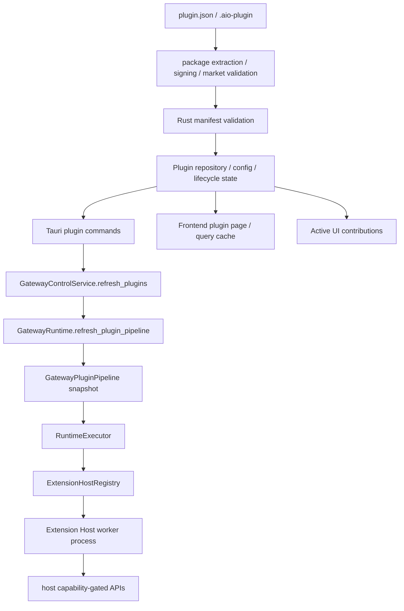

# Plugin 插件体系架构审计报告（2026-07-02）

## 1. 审计结论

当前 Plugin 体系已经从早期多 runtime 设想，收敛到 **Extension Host-only 的社区插件模型**。这个方向是正确的：第三方代码不进入 Rust 主进程或 Tauri WebView，而是通过 host-managed Extension Host worker 执行；插件能力通过 `contributes.*` 与 `capabilities` 声明；gateway hook 由宿主裁剪上下文、限制 mutation、记录审计，并使用 timeout/circuit/failure-policy 约束执行。

总体判断：

- 架构主线：健康，且安全边界清晰。
- 契约收敛：较好，Rust、SDK、JSON contract、文档和脚手架大体一致。
- 生命周期：运行中 gateway pipeline 与 Extension Host dispose/retain 链路基本闭合。
- 性能：默认路径可控，已有 snapshot、budget、warm cache 与 circuit；但缺少自动化性能门槛。
- 主要风险：不是“插件体系不可用”，而是几个边界需要继续收紧，尤其是日志脱敏失败策略、plugin storage 与 config 混用、protocol bridge 未来态声明、CI completion 检查漂移。

没有发现 P0 级问题。建议优先处理 4 个 P1 收敛项，然后再清理 P2 级文档、平台兼容和维护性问题。

## 2. 审计范围与方法

本报告按 systematic debugging 的方式做架构审计：先查证现状，再形成判断，不直接做代码修复。

审计范围：

- Manifest 与契约：`src-tauri/src/domain/plugins.rs`、`docs/plugin-manifest-v1.md`、`docs/plugins/plugin-api-v1-contract.json`
- Gateway pipeline：`src-tauri/src/gateway/plugins/pipeline.rs`、`context.rs`、`mutation.rs`、`permissions.rs`
- Extension Host：`src-tauri/src/app/plugins/extension_host*.rs`、`runtime_executor.rs`、`extension_host_registry.rs`
- 生命周期命令：`src-tauri/src/commands/plugins.rs`、`src-tauri/src/app/plugin_service.rs`、`src-tauri/src/gateway/control_service.rs`
- 分发安全：`src-tauri/src/infra/plugins/package.rs`、`market.rs`、`signing.rs`
- 前端与开发者体验：`src/services/plugins.ts`、`src/query/plugins.ts`、`src/plugins/contributions/*`、`packages/plugin-sdk`、`packages/create-aio-plugin`
- 文档与治理：`docs/plugins/*`、`docs/plugin-system-rfc.md`、`docs/plugin-system-development-plan.md`、`.github/workflows/ci.yml`、`src-tauri/.trellis/*`

关键验证命令：

| 命令 | 结果 |
| --- | --- |
| `pnpm check:plugin-api-contract` | 通过 |
| `pnpm check:plugin-system-docs` | 通过 |
| `pnpm check:plugin-system-completion` | 失败：要求 CI 包含 `pnpm --filter create-aio-plugin test` |
| `pnpm plugin-sdk:test` | 通过，28 tests |
| `pnpm plugin-sdk:typecheck` | 通过 |
| `pnpm create-aio-plugin:test` | 通过，30 tests |
| `cargo test --lib`（`src-tauri`） | 通过，1618 passed / 0 failed / 3 ignored |

## 3. 当前架构地图

设计核心是 **host-owned boundary**：

- 插件声明意图，不直接获得宿主对象。
- 宿主决定可见上下文、可写 mutation、失败策略、生命周期和审计。
- Extension Host 是唯一公开社区 runtime。
- 官方插件不绕过 manifest/capability/lifecycle，只是在分发来源与默认配置上有特殊身份。

## 4. 已经收敛得比较好的部分

### 4.1 Runtime 方向明确

`docs/plugin-manifest-v1.md` 明确：Plugin API v1 只有一种公开社区 runtime，必须使用 `runtime.kind = "extensionHost"`，并提供 `main` 指向打包后的 JS 输出。旧 WASM、process 和 native 都属于 unsupported pre-release legacy runtime。

证据：

- `docs/plugin-manifest-v1.md:3` 说明社区插件只有 Extension Host。
- `docs/plugin-manifest-v1.md:19` 说明不再使用 top-level `hooks` 或 `permissions`。
- `docs/plugin-manifest-v1.md:56` 到 `docs/plugin-manifest-v1.md:70` 明确 runtime 示例和 legacy runtime 拒绝策略。
- `docs/plugins/plugin-api-v1-contract.json:264` 到 `docs/plugins/plugin-api-v1-contract.json:265` 把 `communityRuntimes` 固定为 `extensionHost`，并列出 unsupported legacy runtimes。

Rust 侧与 SDK 侧也一致：

- `src-tauri/src/domain/plugins.rs:529` 到 `src-tauri/src/domain/plugins.rs:541` 只接受 `PluginRuntime::ExtensionHost`。
- `src-tauri/src/domain/plugins.rs:716` 到 `src-tauri/src/domain/plugins.rs:752` 要求 `main`、`language == "typescript"`，拒绝 top-level hooks/permissions，并校验 contributions/capabilities。
- `packages/plugin-sdk/src/index.ts:367` 到 `packages/plugin-sdk/src/index.ts:424` 做同构校验。
- `packages/create-aio-plugin/src/devtools.ts:89` 把 `wasm/process/native` 作为不支持的 public templates。
- `packages/create-aio-plugin/src/devtools.ts:642` 到 `packages/create-aio-plugin/src/devtools.ts:652` 对 legacy runtime 给出迁移提示。

### 4.2 Gateway pipeline 的防线比较完整

Pipeline 的默认配置是 5000 ms timeout、3 次失败打开 circuit、30 秒 cooldown：

- `src-tauri/src/gateway/plugins/pipeline.rs:106` 到 `src-tauri/src/gateway/plugins/pipeline.rs:123`
- `docs/plugins/reference/hooks.md:5` 到 `docs/plugins/reference/hooks.md:9`

Pipeline 刷新时不是在请求路径中动态扫描插件，而是替换 snapshot：

- `src-tauri/src/gateway/plugins/pipeline.rs:1131` 到 `src-tauri/src/gateway/plugins/pipeline.rs:1146` 先让 executor retain/prune runtime caches，再替换 hook snapshot，并裁剪 circuit state。
- `src-tauri/src/gateway/plugins/pipeline.rs:1482` 到 `src-tauri/src/gateway/plugins/pipeline.rs:1512` 只索引 enabled plugin，按 hook 聚合，并按 `(priority, plugin_id)` 排序。

这对可预测性很重要：同一批插件的执行顺序稳定，刷新是显式生命周期动作，不会在每个请求中重新解析 DB。

### 4.3 Extension Host 隔离边界明确

Extension Host 子进程使用 JSON-RPC-over-stdio：

- `src-tauri/src/app/plugins/extension_host_process.rs:1` 声明用途。
- `src-tauri/src/app/plugins/extension_host_process.rs:80` 到 `src-tauri/src/app/plugins/extension_host_process.rs:86` 使用 `env_clear()` 后再恢复 allowlist 环境，并只接管 stdin/stdout/stderr。
- `src-tauri/src/app/plugins/extension_host_process.rs:157` 到 `src-tauri/src/app/plugins/extension_host_process.rs:210` 每次调用都通过 timeout 包裹，超时或协议错误会 kill child。

Host API 通过 capability gate 开放：

- `src-tauri/src/app/plugins/extension_host.rs:352` 到 `src-tauri/src/app/plugins/extension_host.rs:365` 只暴露 storage、diagnostics、privacy 几组 host method。
- `src-tauri/src/app/plugins/extension_host.rs:368` 到 `src-tauri/src/app/plugins/extension_host.rs:377` 对每个 API 做 capability 检查。

Warm cache key 包含插件身份、版本、安装路径、main、runtime、contribution hash 和 gateway call timeout：

- `src-tauri/src/app/plugins/extension_host_registry.rs:29` 到 `src-tauri/src/app/plugins/extension_host_registry.rs:39`
- `src-tauri/src/app/plugins/extension_host_registry.rs:651` 到 `src-tauri/src/app/plugins/extension_host_registry.rs:686`
- contribution hash 覆盖 runtime/main/activationEvents/contributes/capabilities/permissions：`src-tauri/src/app/plugins/extension_host_registry.rs:814` 到 `src-tauri/src/app/plugins/extension_host_registry.rs:825`

配置没有进入 warm cache key，但 gateway hook payload 每次会带最新 config：

- `src-tauri/src/app/plugins/extension_host_registry.rs:349` 到 `src-tauri/src/app/plugins/extension_host_registry.rs:354`

这个设计让配置更新不必重启 worker，只要插件逻辑不把配置永久缓存为不可更新状态即可。

### 4.4 生命周期刷新链路闭合

插件 lifecycle command 会刷新运行中的 gateway plugin pipeline：

- `src-tauri/src/commands/plugins.rs:617` 到 `src-tauri/src/commands/plugins.rs:623`
- `src-tauri/src/app/gateway_control.rs:104` 到 `src-tauri/src/app/gateway_control.rs:110`
- `src-tauri/src/gateway/control_service.rs:203` 到 `src-tauri/src/gateway/control_service.rs:211`
- `src-tauri/src/gateway/runtime.rs:191` 到 `src-tauri/src/gateway/runtime.rs:193`

disable/uninstall 还会 dispose 已初始化的 Extension Host 实例：

- `src-tauri/src/commands/plugins.rs:626` 到 `src-tauri/src/commands/plugins.rs:633`
- `src-tauri/src/commands/plugins.rs:637` 到 `src-tauri/src/commands/plugins.rs:670`

`plugin_save_config` 会刷新 pipeline，但不 dispose Extension Host：

- `src-tauri/src/commands/plugins.rs:675` 到 `src-tauri/src/commands/plugins.rs:687`

结合 hook payload 每次携带 `detail.config`，这是合理取舍。后续如果支持长期订阅或插件自维护状态，才需要更强的 config-change notification。

### 4.5 分发安全基础扎实

`.aio-plugin` 包有多层限制：

- 默认 package 32 MiB、entry 256、解压后 64 MiB：`src-tauri/src/infra/plugins/package.rs:11` 到 `src-tauri/src/infra/plugins/package.rs:25`
- zip entry 路径防绝对路径和 `..`：`src-tauri/src/infra/plugins/package.rs:364` 到 `src-tauri/src/infra/plugins/package.rs:399`
- `main` 必须是包内相对路径，且 `.js` 或 `.cjs`，大小不超过 1 MiB：`src-tauri/src/infra/plugins/package.rs:262` 到 `src-tauri/src/infra/plugins/package.rs:301`
- checksum 使用 `sha256:` 且 constant-time compare：`src-tauri/src/infra/plugins/signing.rs:8` 到 `src-tauri/src/infra/plugins/signing.rs:25`
- Ed25519 signature 校验完整：`src-tauri/src/infra/plugins/signing.rs:27` 到 `src-tauri/src/infra/plugins/signing.rs:59`
- market 解析会拦截 revoked、incompatible、reserved official namespace：`src-tauri/src/infra/plugins/market.rs:62` 到 `src-tauri/src/infra/plugins/market.rs:72`

### 4.6 前端没有执行任意插件 UI 代码

前端 host-rendered contribution 只解析宿主支持的 schema 类型：

- `src/plugins/contributions/HostRenderedContribution.tsx:149` 到 `src/plugins/contributions/HostRenderedContribution.tsx:168`

按钮字段只触发已声明 command，并附带 plugin/contribution 上下文：

- `src/plugins/contributions/HostRenderedContribution.tsx:229` 到 `src/plugins/contributions/HostRenderedContribution.tsx:242`
- `src/plugins/contributions/ContributionSlot.tsx:36` 到 `src/plugins/contributions/ContributionSlot.tsx:44`

这是对插件 UI 的重要安全约束：社区插件不能把任意 React/JS UI 注入 WebView。

## 5. 主要风险与潜在问题

### P1-1：`log.beforePersist` 默认 fail-open，隐私安全语义需要再收紧

现状：

- 文档规定 v1 默认 failure policy 是 `fail-open`：`docs/plugins/reference/hooks.md:5` 到 `docs/plugins/reference/hooks.md:7`
- `log.beforePersist` 也默认 fail-open：`docs/plugins/reference/hooks.md:152` 到 `docs/plugins/reference/hooks.md:160`
- 代码中 log hook 返回非法 payload 或执行失败时，会保留原始日志继续入库：`src-tauri/src/gateway/proxy/logging.rs:263` 到 `src-tauri/src/gateway/proxy/logging.rs:303`

风险：

如果用户把官方 Privacy Filter 或同类插件理解为“日志持久化前的强隐私边界”，那么 fail-open 会让 hook 超时、崩溃、payload 无效时保留原始日志。对普通可用性插件，fail-open 是合理默认；对日志脱敏插件，安全语义偏弱。

建议：

1. 将官方隐私过滤路径改成 host fallback redaction：插件失败时至少使用宿主内置 redaction service 兜底。
2. 或对 `official.privacy-filter` 的 `log.beforePersist` 采用 fail-closed / drop-log / redact-to-placeholder 策略。
3. 如果暂不改行为，文档和 UI 必须明确：默认 fail-open 是可用性优先，不能作为强制合规日志脱敏保证。

### P1-2：`storage.plugin` 复用 `plugin config.storage`，职责边界混合

现状：

- Extension Host storage API 需要 `storage.plugin` capability：`src-tauri/src/app/plugins/extension_host.rs:379` 到 `src-tauri/src/app/plugins/extension_host.rs:394`
- 写入时把数据放进 `detail.config.storage`，并通过 `repository::save_plugin_config` 保存：`src-tauri/src/app/plugins/extension_host.rs:399` 到 `src-tauri/src/app/plugins/extension_host.rs:433`
- storage 有 64 KiB 限制：`src-tauri/src/app/plugins/extension_host.rs:419` 到 `src-tauri/src/app/plugins/extension_host.rs:429`

风险：

用户配置和插件内部状态共享同一 JSON config，容易带来：

- schema 语义混合：`configSchema` 面向用户表单，`storage` 面向插件私有状态。
- 配置迁移不清晰：`configVersion` 是用户配置版本，storage 是否跟随同一版本不明确。
- UI/备份/审计语义混合：导出配置时会夹带运行状态。
- 冲突风险：插件 schema 如果也定义 `storage` 字段，会和 host API 约定相撞。

建议：

1. 中期拆出独立 `plugin_storage` 表，key/value 受 plugin id 隔离。
2. 短期至少把 `storage` 作为保留字段写入 manifest/schema 文档，并让 config schema validator 禁止插件声明顶层 `storage`。
3. 明确导入导出与卸载语义：卸载时保留还是删除 storage，应和 config/audit 分开定义。

### P1-3：Protocol bridge 是公开声明骨架，不是完整执行能力

现状：

- JSON contract 标记 `protocolBridgeContribution.status = "mvp-skeleton"`，执行边界是 manifest declaration、capability dependency、contribution registry metadata 和 install preview；完整执行是 future host integration，当前执行入口仍返回 not implemented：`docs/plugins/plugin-api-v1-contract.json`
- Rust 侧 `ExtensionProtocolBridgeRegistry::execute` 返回 not implemented：`src-tauri/src/app/plugins/extension_protocol_bridge.rs:27` 到 `src-tauri/src/app/plugins/extension_protocol_bridge.rs:40`
- 文档也说明 protocol bridge MVP skeleton 只稳定声明、metadata 和预检展示：`docs/plugins/reference/manifest.md`

风险：

契约里已经有 `protocolBridges` 和 `protocol.bridge` capability，开发者可能误以为声明 bridge 即可接管 Claude/OpenAI/Gemini 协议转换。当前实际上还是未来态。

建议：

1. 前端和脚手架对 protocol bridge 标记 “preview / declaration only”。
2. publish-check 对 protocol bridge 包给出非阻断 warning。
3. 在完整 dispatch 链路落地前，不把 protocol bridge 放入“稳定可执行能力”列表。

### P1-4：completion 检查与 CI 表达方式不一致

现状：

- `pnpm check:plugin-system-completion` 失败，报 `.github/workflows/ci.yml` 缺少 `pnpm --filter create-aio-plugin test`。
- completion 脚本要求精确包含该字符串：`scripts/check-plugin-system-completion.mjs:61` 到 `scripts/check-plugin-system-completion.mjs:72`
- 但 CI 实际运行的是根脚本 `pnpm create-aio-plugin:test`：`.github/workflows/ci.yml:132` 到 `.github/workflows/ci.yml:133`
- `package.json` 中该根脚本确实等价展开为 `pnpm --filter create-aio-plugin test`：`package.json:32` 到 `package.json:34`

风险：

这不是运行时风险，而是治理风险：completion contract 不能通过会降低它作为“体系收敛哨兵”的可信度。以后真实缺口可能被误认为脚本误报。

建议：

二选一：

1. CI 改为直接写 `pnpm --filter create-aio-plugin test`。
2. completion 脚本接受根脚本 wrapper，并同时校验 `package.json` 脚本内容。

### P2-1：market `platforms` 字段解析但未参与兼容性判断

现状：

- `RawHostCompatibility.platforms` 有字段，但 `is_compatible` 只检查 app version 和 plugin API：`src-tauri/src/infra/plugins/market.rs:137` 到 `src-tauri/src/infra/plugins/market.rs:153`
- 文档示例把 `platforms` 放进 hostCompatibility：`docs/plugin-manifest-v1.md:72` 到 `docs/plugin-manifest-v1.md:84`

风险：

跨平台插件可能在 marketplace 中被标为 compatible，但实际只有某个平台可用。对纯 JS Extension Host 风险较小；对未来涉及文件路径、外部 CLI、平台 API 的插件会放大。

建议：

短期文档说明 `platforms` 当前是声明/展示字段；中期在 market 和 install/update preview 中纳入当前 OS 判断。

### P2-2：package 解压大小依赖 zip metadata，实际 copied 累计可再加固

现状：

- 解压前累计 `file.size()` 检查总解压大小：`src-tauri/src/infra/plugins/package.rs:144` 到 `src-tauri/src/infra/plugins/package.rs:176`
- 实际 copy 后只检查单文件 `copied > max_extracted_bytes`：`src-tauri/src/infra/plugins/package.rs:198` 到 `src-tauri/src/infra/plugins/package.rs:224`

风险：

通常 zip crate 的 `file.size()` 是 uncompressed size，已有测试覆盖 oversized extracted package。但 defense-in-depth 角度，仍建议在 copy 阶段累计 actual copied bytes，并和 metadata 结果交叉检查，避免依赖 archive metadata 语义。

建议：

在第二轮解压 copy 中累加 `actual_copied_total`，超过限制立即失败，并在测试中覆盖 metadata/copy 不一致的异常 archive。

### P2-3：`plugin_service.rs` 中心化过重

现状：

- `src-tauri/src/app/plugin_service.rs` 约 5786 行。
- 同一文件承载安装、更新、回滚、官方插件、market、signature、config、contribution impact、gateway active list 和大量测试。

风险：

短期不会破坏功能，但会降低新增贡献点、调整生命周期和审查安全边界的速度。插件体系未来如果继续扩展 provider values、protocol bridge、runtime reports，中心文件会越来越难维护。

建议：

按职责逐步拆分，不做一次性大重构：

- `plugin_lifecycle_service`
- `plugin_install_service`
- `plugin_update_service`
- `plugin_config_service`
- `plugin_contribution_impact`
- `official_plugin_service`

拆分时保持 public command API 不变，并先移动测试 helper。

### P2-4：前端 typed slot 小于 contract slot，属于接入边界而非 bug

现状：

- Contract 中 UI slots 有 12 个：`docs/plugins/plugin-api-v1-contract.json:40` 到 `docs/plugins/plugin-api-v1-contract.json:52`
- 前端 typed slot 只有 3 个：`src/plugins/contributions/types.ts:3` 到 `src/plugins/contributions/types.ts:6`

风险：

开发者看到 contract 中更大的 slot surface，可能误以为所有 slot 都已经在 UI 中可见。实际目前只接入 provider editor sections、settings sections、logs detail tabs。

建议：

1. contract 增加 slot status：`active` / `reserved` / `future`。
2. SDK validator 可继续接受未来 slot，但脚手架和文档要标出当前 UI 接入状态。
3. 前端 slot registry 和 contract 生成/检查同步，减少手写漂移。

### P2-5：前端数据访问展示存在 drift 风险

现状：

- `PluginsPage.tsx` 使用本地 `GATEWAY_HOOK_ACCESS` 映射计算展示权限：`src/pages/PluginsPage.tsx:127`、`src/pages/PluginsPage.tsx:332` 到 `src/pages/PluginsPage.tsx:342`
- 执行权限真实边界在后端 access policy / pipeline，不依赖前端展示。

风险：

这不是安全绕过，因为前端不做授权裁决；但 UI 风险说明如果和后端 hook access drift，会误导用户。

建议：

从生成的 contract 或后端导出的 metadata 派生 UI 展示映射，避免手写两份。

### P2-6：性能验证存在但不在默认门禁

现状：

- package script 提供 `plugin:perf-smoke`：`package.json:31`
- pipeline 中有 ignored perf smoke：`src-tauri/src/gateway/plugins/pipeline.rs:2099` 到 `src-tauri/src/gateway/plugins/pipeline.rs:2114`

风险：

插件体系本身处在请求路径上。只靠功能测试无法发现 hook snapshot、context budget、JSON-RPC 或 warm cache 修改带来的延迟回归。

建议：

1. 为空 pipeline、单 noop plugin、Extension Host cold/warm hook 建立固定 perf baseline。
2. 默认 CI 可只跑轻量阈值测试；release 前跑 ignored perf smoke。
3. runtime reports 中补充 p50/p95 聚合查询，便于用户发现慢插件。

### P2-7：Trellis 项目级入口缺失，后端规范仍是模板

现状：

- 根目录没有 `.trellis/`，只有 `src-tauri/.trellis/`。
- `src-tauri/.trellis/spec/backend/index.md` 仍写着 “Fill in each file with your project's specific conventions”：`src-tauri/.trellis/spec/backend/index.md:7` 到 `src-tauri/.trellis/spec/backend/index.md:21`
- `directory-structure.md` 仍是 “To be filled by the team”：`src-tauri/.trellis/spec/backend/directory-structure.md:7` 到 `src-tauri/.trellis/spec/backend/directory-structure.md:54`

风险：

这会让新贡献者或后续 agent 难以判断插件体系在 backend/domain/app/infra/gateway/commands 之间的职责边界。

建议：

补一份插件体系专项规范：

- manifest validation 属于 `domain`
- lifecycle orchestration 属于 `commands` + `app`
- persistence/package/signing/market 属于 `infra`
- gateway request path 属于 `gateway`
- Extension Host runtime 归 `app/plugins`

## 6. 生命周期审计

生命周期阶段：

1. Install / update preview：读取 package、校验 manifest、展示 contribution/config/permission impact。
2. Install / update：验证 checksum/signature/source，写入 package cache 和 installed dir，持久化 DB state。
3. Enable：验证 manifest 和 duplicate command ownership，切换状态。
4. Gateway refresh：读取 enabled plugins，跳过 invalid/legacy plugin，替换 pipeline snapshot。
5. Execute：pipeline 按 hook 查 snapshot，裁剪 context，调用 runtime executor。
6. Extension Host：按 key 复用或 cold start worker，执行 hook/command。
7. Disable / uninstall / rollback：刷新 pipeline，dispose 对应 Extension Host 实例，保留 audit logs。
8. Save config：保存 config，刷新 pipeline；不强制 dispose worker。

生命周期优点：

- enabled plugin 在进入 gateway 前会重新 validate，invalid manifest 会被跳过：`src-tauri/src/app/plugin_service.rs:344` 到 `src-tauri/src/app/plugin_service.rs:356`
- pipeline refresh 会 prune runtime caches 和 circuit state。
- disable/uninstall 后会 dispose plugin worker。
- config update 不重启 worker，但每次 hook payload 带最新 config。

生命周期注意点：

- 如果未来插件支持 long-running subscription、background task、provider daemon，需要新增 config-change event 或强制 dispose 语义。
- rollback/update 的 Extension Host dispose 应继续作为强制不变量保留，防止旧代码与新 manifest 混跑。

## 7. 性能审计

已有性能友好点：

- Hook snapshot 预构建，按 hook 聚合，避免每次请求查 DB。
- 空 pipeline / no active hook 可走快速路径。
- Context 和 mutation 都有 budget，避免把完整大 body 暴露给插件。
- Extension Host warm cache 默认最多 8 个实例，idle recycle 120s：`src-tauri/src/app/plugins/extension_host_registry.rs:24` 到 `src-tauri/src/app/plugins/extension_host_registry.rs:54`
- 子进程 JSON-RPC 有 max line bytes，worker 默认 max line 根据 request body cap 推导：`src-tauri/src/app/plugins/extension_host_worker.rs:16` 到 `src-tauri/src/app/plugins/extension_host_worker.rs:23`

性能风险：

- 5000 ms hook timeout 适合轻量 redaction/rewrite，不适合远程 I/O 或复杂模型调用；SDK/文档应继续强调 hook 中不应做长耗时操作。
- Command 默认 JS timeout 是 30s：`src-tauri/src/app/plugins/extension_host_worker.rs:18`、`src-tauri/src/app/plugins/extension_host_worker.rs:1179` 到 `src-tauri/src/app/plugins/extension_host_worker.rs:1185`。这与 gateway hook 5000ms 是不同场景，不是漂移；但文档要避免混淆。
- Extension Host cold start 成本没有默认 CI 性能阈值。
- 同插件串行、跨插件并行的行为有利于隔离同一插件状态，但慢插件仍可能影响其 own hook/command 后续调用。

## 8. 文档与契约收敛审计

收敛良好：

- `docs/plugin-system-development-plan.md` 已标为 Superseded，避免把早期 WASM/process 规划当成当前方向：`docs/plugin-system-development-plan.md:3` 到 `docs/plugin-system-development-plan.md:9`
- `docs/plugins/README.md` 当前稳定性说明非常清晰：`docs/plugins/README.md:46` 到 `docs/plugins/README.md:52`
- `scripts/check-plugin-api-contract.mjs` 会检查 legacy runtime、manual permission wrapper、SDK/frontend/docs 一致性。
- `scripts/check-plugin-system-docs.mjs` 会防止旧 WASM/process 叙述重新进入主线文档。

仍需收敛：

- `check-plugin-system-completion` 当前失败，必须修。
- `protocolBridges`、provider extension values、UI slots 需要 status 标注，避免 contract 看起来比 runtime 接入更成熟。
- Trellis 后端规范要从模板变成项目实际规范。

## 9. 建议路线图

### 短期（1 周内）

1. 修复 `check-plugin-system-completion` 与 CI 表达方式不一致。
2. 在文档和 UI 中明确 `log.beforePersist` fail-open 的安全语义；官方 privacy filter 至少加 warning。
3. 明确 `protocolBridges` 是 declaration-only / MVP skeleton。
4. 文档声明 `hostCompatibility.platforms` 当前是否参与实际筛选；如果不参与，标为 metadata-only。

### 中期（1 到 3 周）

1. 拆出 `plugin_storage`，或至少保留顶层 `storage` 字段并禁止 schema 冲突。
2. package extraction 增加实际 copied bytes 累计限制。
3. 前端数据访问展示从 contract/generated metadata 派生。
4. 给 UI slot 增加 active/future status，并让 SDK/文档/前端共享同一来源。
5. 为 empty pipeline、noop plugin、Extension Host cold/warm hook 增加轻量性能门禁。

### 长期（一个版本周期）

1. 将 `plugin_service.rs` 按 install/update/config/official/impact/lifecycle 拆分。
2. 完整定义 protocol bridge runtime contract，包括 dispatch、streaming、error mapping、权限和 replay。
3. 为 Extension Host background/lifecycle event 建立通用模型：activate、execute、configChanged、dispose。
4. 建立插件体系 release checklist：contract check、docs check、SDK tests、scaffolder tests、Rust plugin tests、perf smoke、manual install/update/rollback smoke。

## 10. 风险总表

| 等级 | 问题 | 影响 | 建议动作 |
| --- | --- | --- | --- |
| P1 | `log.beforePersist` fail-open 对隐私语义偏弱 | hook 失败时可能保留原始日志 | host fallback redaction 或官方插件 fail-closed/drop-log |
| P1 | `storage.plugin` 和用户 config 共用 JSON | schema、迁移、导出语义混合 | 拆独立 storage 或保留字段并禁止冲突 |
| P1 | protocol bridge 是未来态但已出现在 contract | 开发者误解能力已完整可执行 | 标注 preview/declaration-only，publish-check warning |
| P1 | completion check 与 CI 不一致 | 收敛哨兵失效 | 修改 CI 或脚本接受 wrapper |
| P2 | market `platforms` 未参与判断 | 跨平台兼容误导 | 纳入 OS 判断或标为 metadata-only |
| P2 | 解压实际 copied total 未累计检查 | defense-in-depth 不足 | 增加 actual copied total 限制 |
| P2 | `plugin_service.rs` 过大 | 后续扩展维护成本高 | 按职责渐进拆分 |
| P2 | 前端 slot 小于 contract slot | 契约与 UI 接入面不等宽 | 增加 slot status 和生成同步 |
| P2 | 前端权限展示手写映射 | UI 风险说明可能 drift | 从后端/contract 派生 |
| P2 | 性能 smoke ignored | 请求路径回归不易发现 | 加轻量 perf gate |
| P2 | Trellis spec 模板化 | 新贡献者职责边界不清 | 补插件体系 backend spec |

## 11. 最终判断

Plugin 体系已经从“多 runtime 可能性集合”收敛成“Extension Host 主线 + host-owned 安全边界”。这是一个值得继续投入的架构方向。

下一阶段不建议再扩 public surface，而应先把边界收紧：

1. 隐私 hook 失败语义收紧。
2. storage 与 config 分离。
3. future/skeleton 能力显式标注。
4. completion/CI/docs/contract 继续保持同源收敛。
5. 给请求路径加性能门禁。

做到这些后，再扩 protocol bridge、provider extension values 和更多 UI slots，会更稳。
